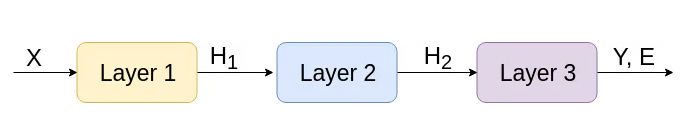
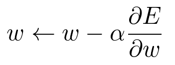
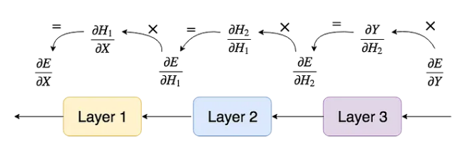

# Neural Network Notes

Credit to https://towardsdatascience.com/math-neural-network-from-scratch-in-python-d6da9f29ce65 for the article, images, and notes.

The output of the previous layer should be input to the next

We compare the output of our network, Y, to the correct output Y' and calculate the error between these, E.

We want to minimize that error.

## Gradient Descent

We want to change some value in our network, w, such that E decreases.

w <- w - a * dE/dw

Alpha is the learning rate

dE/dw is the derivative of E with respect to w.

This function needs to be evaluatable for every network parameter.

## Backwards Propagation

Move backwards in the network updating the previous layers by calculating their new values using the chain rule.

